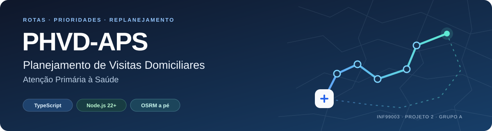
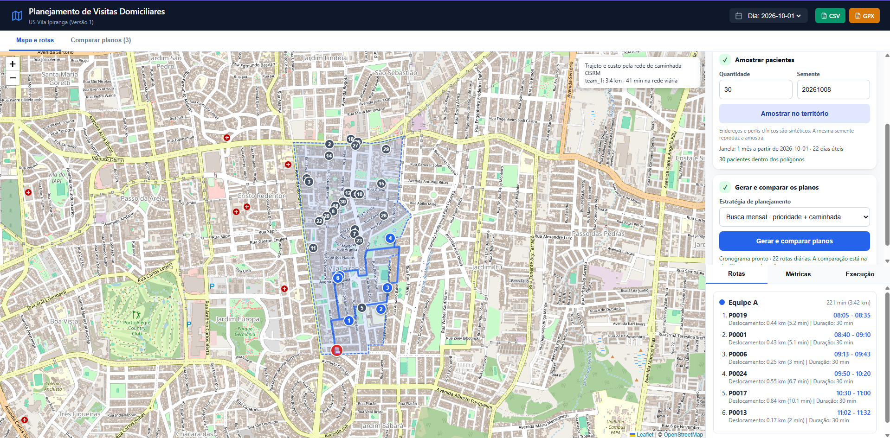
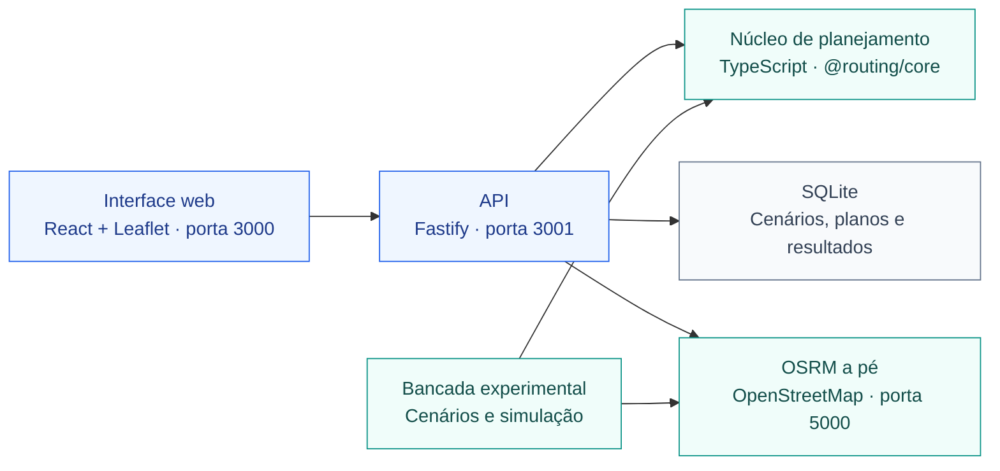

<p align="center">
  
</p>

<h1 align="center">Planejamento de Visitas Domiciliares na APS</h1>

<p align="center">
  Prioridades de atendimento · Rotas a pé · Replanejamento após ausências
</p>

<p align="center">
  <a href="#sobre">O projeto</a> ·
  <a href="#aplicacao">Interface</a> ·
  <a href="#executar">Como executar</a> ·
  <a href="#resultados">Resultados</a> ·
  <a href="#documentacao">Documentação</a>
</p>

<p align="center">
  <sub>INF99003 · Projeto 2 · Grupo A<br/>Fabio Cieslak · Tobias Marion · Vitor Feijo</sub>
</p>

---

<a id="sobre"></a>

## 🧭 Sobre o projeto

**PHVD-APS** é um artefato de pesquisa para planejar e replanejar visitas domiciliares na Atenção Primária à Saúde. Combina prioridades e prazos de atendimento com a jornada das equipes e o deslocamento a pé pela rede OpenStreetMap.

O repositório reúne um **núcleo reutilizável em TypeScript**, uma **aplicação web com mapa e persistência** e uma **bancada de experimentos reproduzíveis**. Os territórios e unidades de saúde vêm do GeoSaúde de Porto Alegre; pacientes, condições, prioridades, prazos e ausências dos experimentos são sintéticos.

A equipe precisa decidir **quem visitar, em qual dia e em que ordem**, respeitando o território, os intervalos entre atendimentos, a disponibilidade e a jornada diária. Uma visita não realizada permanece pendente, com seu prazo original, e exige atualizar a agenda.

O modelo usa um horizonte de **N dias úteis** e antecipação máxima de **A dias corridos**. Cada rota parte da unidade de saúde e retorna a ela; deslocamento e atendimentos precisam caber na jornada. O núcleo verifica os planos antes de retorná-los.

**Pergunta de pesquisa:** quanto uma heurística de horizonte móvel melhora o atendimento das pendências, os atrasos e o deslocamento em relação a regras simples, inclusive após ausências?

**Hipótese investigada:** combinar prioridades, prazos e busca local melhora a resposta temporal com custos operacionais controlados. A avaliação mede atendimento, caminhada e cálculo separadamente para identificar os compromissos entre esses objetivos.

### Três formas de construir a agenda

| Estratégia | Como constrói o planejamento |
|---|---|
| **Urgência** (`urgency-baseline`) | Ordena as visitas elegíveis pela prioridade calculada a partir de atraso e peso da condição, inserindo as que cabem na jornada. |
| **Vizinho próximo** (`nearest-baseline`) | Escolhe a próxima visita elegível e viável com menor tempo de deslocamento. |
| **Principal** (`main-heuristic`) | Parte da construção geográfica, melhora rotas, move visitas entre dias e recupera pendências por prioridade e prazo, admitindo antecipação. |

A melhoria intra-rota **1.5-opt** combina reinserção de uma visita e inversão de um segmento. Ela está habilitada nas três estratégias nos experimentos finais. Todos os métodos recebem a mesma demanda e matriz de caminhada em cada comparação. Consulte a [implementação da heurística principal](artefato/packages/core/src/strategies/main-heuristic.ts) e a [documentação dos métodos](artefato/README.md).

---

<a id="aplicacao"></a>

## 🗺️ A aplicação

| 🗺️ Território e mapa | 📊 Planos comparáveis | 🔄 Execução e continuidade |
|---|---|---|
| Territórios GeoSaúde e pacientes amostrados com semente reproduzível. | Três estratégias sobre a mesma versão do cenário, com indicadores de atendimento. | Registro de visitas concluídas ou não realizadas e replanejamento. |
| Rotas a pé por dia e equipe. | Exportação de rotas em **CSV** e **GPX**. | Cenários, versões, planos e resultados persistidos em **SQLite**. |

<p align="center">
  
</p>

<p align="center">
  <sub>Protótipo na US Vila Ipiranga · 30 pacientes sintéticos · Rota pela rede de caminhada</sub>
</p>

### Como as partes se conectam



O núcleo recebe cenários e uma matriz de custos, sem depender de navegador, banco ou servidor. A API obtém a matriz no OSRM e persiste os resultados; a interface e a bancada usam o mesmo núcleo.

---

<a id="executar"></a>

## 🚀 Executar a aplicação

> [!TIP]
> Primeira execução? O [guia de execução local](artefato/GUIA_EXECUCAO_LOCAL.md) acompanha desde o clone e a obtenção do mapa até a interface.

Execute os comandos a partir da **raiz do repositório**, onde estão este README e o `package.json` principal.

### ① Preparar as dependências

Requisitos: **Node.js 22+**, **npm** e, para preparar o servidor de caminhada pelo script fornecido, **Docker** e um ambiente **Bash**. No Windows, o script pode ser executado pelo WSL2 com integração ao Docker Desktop.

```sh
npm ci --prefix artefato
```

Para executar também a bancada:

```sh
npm ci --prefix experimentos
```

Os pacotes da aplicação são workspaces de `artefato/`; a bancada tem seu próprio arquivo de dependências. Os comandos usam os respectivos `package-lock.json`.

### ② Iniciar o OSRM de caminhada

Use um arquivo **`.osm.pbf` que cubra Porto Alegre**. Em um terminal Bash, na raiz do projeto:

```bash
bash artefato/scripts/start-walking-osrm.sh /caminho/porto-alegre.osm.pbf
```

Substitua o caminho pelo arquivo do mapa no ambiente em que o comando será executado. O [script](artefato/scripts/start-walking-osrm.sh) prepara a rede com `foot.lua` e mantém o OSRM na porta **5000**. Deixe esse terminal aberto. O arquivo do mapa e os índices gerados são preparados localmente.

### ③ Abrir a aplicação

Em outro terminal, na raiz do projeto:

**PowerShell:**

```powershell
$env:OSRM_BASE_URL = 'http://127.0.0.1:5000'
npm start
```

<details>
<summary><strong>Linux, macOS ou WSL: iniciar com Bash</strong></summary>

```bash
OSRM_BASE_URL=http://127.0.0.1:5000 npm start
```

</details>

`npm start` compila os três pacotes da aplicação pelo script `prestart` e inicia os dois serviços:

| Serviço | Endereço |
|---|---|
| Interface web | <http://localhost:3000> |
| API | <http://localhost:3001/api> |
| OSRM configurado nos exemplos | <http://127.0.0.1:5000> |

A geração dos planos depende do OSRM configurado e acessível. No PowerShell, defina a variável na sessão que inicia a aplicação ou os experimentos. A instrução de Bash `OSRM_BASE_URL=... comando` tem outra sintaxe.

Na interface, selecione uma unidade, amostre pacientes, gere os planos e abra **Comparar planos**. Depois escolha uma rota no mapa ou registre resultados de visitas. O cronograma da interface cobre um mês; o estudo de 250 pacientes com limite de doze meses é executado pela bancada.

Para encerrar, pressione **Ctrl+C** no terminal da aplicação e no terminal do OSRM.

---

<a id="resultados"></a>

## 📊 Experimentos e resultados

Os três estudos finais usam custos de caminhada do OSRM, ausência de **0%, 5% e 10% por tentativa** e comparação entre principal, vizinho próximo e urgência. Planos previstos e execução simulada são analisados separadamente.

**Médias da heurística principal em comparação com o vizinho próximo:**

| 🗺️ Porto Alegre | 🧪 Fatorial na Restinga | 🚶 250 pacientes na Restinga |
|:---:|:---:|:---:|
| **+6,45 p.p.** de prioridade atendida a tempo | **+9,65 p.p.** de prioridade atendida a tempo | **5,56 dias úteis antes** de concluir |
| **1,1% menos** caminhada | **3,03% mais** caminhada | **13,03% menos** caminhada |
| 131 territórios avaliados | 324 cenários · 15 a 90 pacientes | 250 visitas concluídas em todas as execuções |
| **1.179** simulações | **2.916** simulações | **27** simulações |
| [Ver resultados](experimentos/analise/porto-alegre-caminhada/resumo-slides.md) | [Ver resultados](experimentos/analise/fatorial-caminhada/resumo.md) | [Ver resultados](experimentos/analise/longo-250-caminhada/resumo.md) |

No fatorial, o atraso controlável ponderado também caiu **0,55 dia** em média. O custo de cálculo foi maior; no estudo longo, as médias acumuladas da principal variaram de **22,14 s a 151,78 s** conforme a taxa de ausência.

<details>
<summary><strong>Conferir o desenho e a capacidade de cada estudo</strong></summary>

| Estudo | Base e condições | Simulações |
|---|---|---:|
| [Territorial](experimentos/analise/porto-alegre-caminhada/resumo-slides.md) | **131 territórios de Porto Alegre**, 30 pacientes por território, 22 dias úteis, uma equipe de 240 min/dia. | **1.179** |
| [Fatorial](experimentos/analise/fatorial-caminhada/resumo.md) | **US Restinga**; 324 cenários, três sementes; 15/30/45/90 pacientes, área, horizonte e demanda vencida; uma equipe de 240 min/dia. | **2.916** |
| [250 pacientes](experimentos/analise/longo-250-caminhada/resumo.md) | **US Restinga**, três sementes, uma equipe de **300 min/dia**, limite de 261 dias úteis até concluir as visitas iniciais. | **27** |

</details>

> [!NOTE]
> **Abrangência:** somente o estudo territorial reúne várias unidades. No fatorial e no estudo de 250 pacientes, a média agrega condições e sementes **da Restinga**, sem representar todas as US. As áreas 0,5× e 2× do fatorial são transformações sintéticas desse território. Dos 132 territórios importados, um foi excluído do estudo territorial por falta de caminho a pé completo.

As comparações principal-vizinho usam **393 pares** no territorial, **972** no fatorial e **9** no estudo longo. Cada par mantém o cenário e a probabilidade de ausência. As médias dos três estudos não devem ser reunidas em um único resultado, pois demandas, jornadas e regras de simulação diferem.

As evidências são descritivas de cenários sintéticos, sem avaliação de benefício clínico ou deslocamentos medidos em campo.

<details>
<summary><strong>Entender as métricas e um exemplo de prioridade</strong></summary>

- **Prioridade atendida a tempo:** soma dos pesos das visitas concluídas a tempo dividida pelos pesos de toda a demanda inicial, multiplicada por 100. Visitas já vencidas contam se forem feitas no primeiro dia. É uma fração de prioridade, não de pacientes.
- **Cobertura efetiva:** fração da demanda inicial que recebeu visita concluída, independentemente do prazo e do peso.
- **Atraso controlável ponderado:** atraso adicional a partir do maior entre início e prazo da visita, ponderado pela prioridade; pendências contam até o encerramento.
- **Caminhada:** soma dos deslocamentos previstos na rede, incluindo tentativas frustradas e retorno à unidade.
- **Cálculo:** tempo acumulado de planejamento na execução; depende da máquina e não inclui caminhada nem obtenção da matriz OSRM.

Por exemplo, visitas de pesos 1, 3 e 5 somam nove pontos. Se apenas a de peso 5 for feita a tempo, o indicador é **55,56% da prioridade**. A diferença entre percentuais de dois métodos é expressa em **pontos percentuais (p.p.)**.

</details>

### Reproduzir os estudos

Com as dependências instaladas e o OSRM a pé ativo, execute na raiz:

**PowerShell:**

```powershell
$env:OSRM_BASE_URL = 'http://127.0.0.1:5000'
npm run experiments:all
```

<details>
<summary><strong>Linux, macOS ou WSL: executar com Bash</strong></summary>

```bash
OSRM_BASE_URL=http://127.0.0.1:5000 npm run experiments:all
```

</details>

Esse comando compila core, server e experimentos, executa os estudos **territorial e fatorial** e gera o relatório fatorial. O estudo de 250 pacientes tem uma sequência própria; execute-a na mesma sessão com `OSRM_BASE_URL` definido:

```sh
npm run build --prefix artefato/packages/core
npm run build --prefix artefato/packages/server
npm run build --prefix experimentos
node experimentos/scripts/probe-long-capacity.mjs
npm run long-horizon --prefix experimentos
```

O teste de capacidade compara os planos iniciais em quatro e doze meses. A simulação longa usa doze meses como **limite comum**, sem retirar feriados, e para quando todas as visitas iniciais são concluídas. Seu replanejamento ocorre após uma ausência; nos estudos territorial e fatorial, o plano é recalculado diariamente.

Os cenários e sementes permitem repetir a geração; os registros por execução ficam em CSV/JSON e as análises em `experimentos/analise/*-caminhada/`. Resultados brutos e matrizes em cache são gerados localmente e podem não estar presentes em um clone. O [relatório fatorial interativo](experimentos/analise/fatorial-caminhada/relatorio.html) pode ser aberto no navegador.

Para reproduzir os custos, preserve também a versão do mapa e o perfil de caminhada. Se mudar o grafo, regenere as matrizes conforme o [README dos experimentos](experimentos/README.md). O comando abaixo compara as matrizes territoriais e fatoriais em cache com o OSRM ativo:

```sh
npm run verify:walking-matrices --prefix experimentos
```

---

<a id="estrutura"></a>

## 📁 Estrutura do repositório

O código da aplicação, a bancada experimental e os materiais acadêmicos têm pastas próprias.

<details>
<summary><strong>Explorar a estrutura de pastas</strong></summary>

```text
inf99003-project_2-group_A/
├── artefato/                      # Aplicação e núcleo compartilhado
│   ├── scripts/                   # Preparação do OSRM de caminhada
│   └── packages/
│       ├── core/                  # Modelagem, estratégias, 1.5-opt e verificação
│       ├── server/                # API Fastify, SQLite, OSRM e exportação
│       └── web/                   # Interface React, Vite e Leaflet
├── experimentos/
│   ├── src/                       # Geração de cenários e simulações
│   ├── cenarios/                  # Entradas JSON
│   ├── provenance/                # Proveniência territorial
│   ├── resultados/                # Saídas CSV/JSON e matrizes geradas localmente
│   └── analise/                   # Sínteses e relatório interativo
├── papers/                        # Revisão bibliográfica e fichamentos
├── projeto_de_pesquisa/           # Formulação e redação acadêmica
├── slides/                        # Apresentações e material de apoio
├── osm-data/                      # Mapa e índices OSRM preparados localmente
├── lab_notebook.md                # Diário de decisões e experimentos
├── run-artefact.js                # Inicialização da API e interface
└── run-experiments.js             # Execução territorial e fatorial
```

</details>

---

<a id="desenvolvimento"></a>

## 🛠️ Desenvolvimento

Todos os comandos partem da raiz. Para planejar, iniciar o servidor com `OSRM_BASE_URL` definido.

| Objetivo | Comando |
|---|---|
| Compilar a aplicação | `npm run build` |
| Compilar a bancada | `npm run build --prefix experimentos` |
| Testar o núcleo | `npm run test --prefix artefato/packages/core` |
| Iniciar somente a API, após compilar | `npm run start:server` |
| Iniciar somente a interface | `npm run start:web` |
| Executar somente o fatorial, após compilar core, server e bancada | `npm run experiments` |
| Gerar a análise fatorial a partir dos resultados | `npm run factorial:report --prefix experimentos` |

`npm run build` compila os workspaces da aplicação, sem incluir a bancada. `npm run experiments` executa o fatorial, sem gerar automaticamente o relatório; `experiments:all` inclui as etapas de compilação e análise. O SQLite é criado em `artefato/packages/server/data/routing.db` quando o servidor é iniciado pelos scripts npm.

---

<a id="documentacao"></a>

## 📚 Documentação e materiais

| Material | Onde consultar |
|---|---|
| Instalação guiada e resolução de problemas | [Guia de execução local](artefato/GUIA_EXECUCAO_LOCAL.md) |
| Arquitetura, contratos, métodos e API | [README do artefato](artefato/README.md) |
| Protocolos, sementes e reprodução | [README dos experimentos](experimentos/README.md) e [protocolo fatorial](experimentos/PROTOCOLO_FATORIAL.md) |
| Formulação da pesquisa | [Projeto de pesquisa](projeto_de_pesquisa/projeto_de_pesquisa.md) |
| Planejamento original do desenvolvimento | [Plano de desenvolvimento](plano_de_desenvolvimento.md) e [plano do framework](plano_framework_roteamento_ts.md) |
| Apresentação final e falas | [Slides em LaTeX](slides/slides-semana_4/slides-semana_4.tex), [roteiro](slides/slides-semana_4/roteiro_apresentacao_semana_4.md) e [slides de apoio](slides/slides-semana_4/apoio.tex) |
| Fontes das figuras e recompilação | [Figuras da apresentação](slides/slides-semana_4/figuras/README.md) |
| Métricas e pseudocódigo para apresentação | [Material da bancada](slides/apoio-banca/README.md) |
| Revisão bibliográfica | [Fichamentos](papers/_papers.md) e [artefatos da literatura](papers/artifacts.md) |
| Histórico das decisões | [Diário de bordo](lab_notebook.md) |
| Orientações para manutenção por agentes | [Guia geral](AGENTS.md), [artefato](artefato/AGENTS.md) e [experimentos](experimentos/AGENTS.md) |

Os planos de desenvolvimento registram a proposta original. Para o comportamento implementado e os resultados atuais, consulte o código, a documentação dos módulos e as análises de caminhada.
